# front-end-project

## Introduction

This is a a dynamic solo project to demonstrate the ability to use plain HTML, CSS, and TypeScript to build the most viable features of an electronic commerce website where the users can:

- Browse the list of products
- Inspect a single products
- Full CRUD on the shopping cart

The project is deployed live at : [Aesthetik Shop](https://jimmytran1206.github.io/front-end-project/index.html)

## Technology used

**HTML5**:

- Semantic tags
- Mixed used of dialog and traditional modals
- Page loading

**CSS**:

- Responsive layout
- Flexbox, Grid, transformation
- CSS Variables

**TypeScript**:

- Asynchronous data fetching from [Dummy JSON](https://dummyjson.com/) API
- Code organization in modules
- Pagination and dynamic rendering

**Third-party library**

- Third-party library [jQuery](https://jquery.com/) and [jQuery Magnify
  ](https://thdoan.github.io/magnify/) are used to make a magnifier lens when viewing individual products.

## Module structure

TypeScript codes are organized into modules for dynamic rendering and future expansion. A glance look at those modules are explained below

### Module `utils.ts`

- Includes the API links, utility functions to get HTML elements, format price, get/set local storage items, and shuffle array elements.

### Module `dataModel.ts`

- Includes data type interfaces expected from the API

### Module `toggleSidebar.ts`

- Turns the navbar on/off in the mobile view when the navbar collapses into a hamburger icon.

### Module `store.ts`

- Include `store` state variable which act as a container for all items getting back from the API, as well as other functions to process data getting back from API. `store` state variables are provided tho all `pages` modules

### Module `magnify.ts`

- Contains third-party library that is used for magnifier lens. This module is not shown in the UML diagram for simplicity.

### Module `fetchProducts.ts`

- Contains function to fetch the product from the API and return the response `Promise`.

### Module `displayProduct.ts`

- Contains functions to display an array of products into specific element. Also contains the event handler to add a specific product to the cart. The event handler is a function declaration (not an anonymous function) so that every time the container is re-rendered, no new event listener is added to the product container element.

### Module `checkout.ts`

- Contains the functionality for the checkout button. When the checkout button is clicked
  - The cart sidebar is hidden
  - If the cart is empty, prompt the user to do more shopping
  - If there are items in the cart, clear the items and display thank you to the user
- This module uses the provided functions `resetCart()` and `readCart()` to hook into the state of the `cart` variable in the module `setupCart.ts`

### The `cart` modules

This folder contain the modules pertaining to the shopping cart.

- Module `toggleCart.ts`: displays/hides the cart sidebar
- Module `addToCartDOM.ts`: renders an item in the cart sidebar when the user click on the cart icon or add-to-cart button
- Module `setupCart.ts`: contains the `cart` variable to keep track of cart items. Also contains functions to control the cart-related features of the app, such as displaying the number of cart items, displaying the total price of all items in the cart, adding/removing items from the cart. Unlike the `store` state variable, the `cart` state variable is kept private to the module, and other modules can access it using the provided functions like `addToCart`, `resetCart`, and `readCart`.

### The `filter` modules

This folder contains the modules pertaining to the filtering functionality of `products.html`. Because of changes in pagination when filtering, these modules use the function `resetIndex` and `displayPagination` to hook into the `index` and `storePages` states of the module `displayPagination.ts`

- Module `categories.ts`: filter and display the products based on selected categories
- Module `price.ts`: filter and display the products based on selected prices
- Module `search.ts`: filter and display the products based on selected search keyword

### The `paginate` modules

This folder contains the modules pertaining to the pagination functionality of `products.html`. These modules were added as a project extension feature after other functionalities are tested and working, which emphasizes the extensibility of this project.

- Module `paginate.ts`: transforms an input array into an array of arrays for pagination
- Module `displayButtons.ts`: displays pagination buttons in the button container based on the number of pages and the currently active page
- Module `displayPagination.ts`: displays the current products in a page, synchronizes the active page with the button UI, and determines the pagination button-click functionality.

### The `pages` modules

This folder contains the modules pertaining to the HTML pages of the application.

- Module `about.ts`: controls the behavior of `about.html` page
- Module `product.ts`: controls the behavior of `product.html` page, such as taking out product id from the path variable, fetching the specific product from API and displaying the product information on the screen.
- Module `products.ts`: controls the behavior of `products.html` page

### The module `index.js`

- Controls the behavior of `index.html` page. It was left out of the `pages` folder because my early planning and testing only scheduled for one TS file before I saw the need of separating codes into several TS modules.

The interdependency among the modules is demonstrated in the below UML diagram. I use UML diagram for strict demonstration only because there is no official way to present the relationships among TypeScript modules.

```mermaid
---
title: Aesthetic project TS Modules Interdependency
---
classDiagram
class utils.ts{
  + allProductsUrl: string
  + singleProductUrl: string
  + getElement(selection: string): HTMLElement
  + formatPrice(price: number): string
  + getStorageItem(name: string): any[]
  + setStorageItem(name: string, item: any[]): void
  + shuffleArray(array: number[]): number[]
}

class dataModel.ts {
  <<interface>>
   + ProductRaw
   + Product
   + ResponseJSON
   + CartItem
}

class toggleSidebar.ts{
  - toggleNav: HTMLElement
  - sidebarOverlay: HTMLElement
  - closeBtn: HTMLElement
}

class store.ts{
  + store: Product[]
  + setupStore(products: ProductRaw[]): void
  + findProduct(idString: string): Product | undefined
}

class fetchProducts.ts{
  + fetchProducts(): Promise<ResponseJSON | undefined>
}

class displayProducts.ts{
 - addToCartClickHandler(e: Event): void
 + display(products: Product[], element: HTMLElement): void
}

class checkout.ts{
  - checkoutBtn: HTMLElement
  - dialog: HTMLDialogElement
  - dialogText: HTMLElement
  - dialogCloseBtn: HTMLElement
  - cartOverlay: HTMLElement
  - cartItemCountDOM: HTMLElement
  - cartItemsDOM: HTMLElement
  - cartTotalDOM: HTMLElement
}

class toggleCart.ts{
  - cartOverlay: HTMLElement
  - closeCartBtn: HTMLElement
  - toggleCartBtn: HTMLElement
}

class addToCartDOM.ts{
  - cartItemsDOM: HTMLElement
   + addToCartDOM(cartItem: CartItem): void
}

class setupCart.ts{
  - cartItemCountDOM: HTMLElement
  - cartItemsDOM: HTMLElement
  - cartTotalDOM: HTMLElement
  - cart: CartItem[]
  + resetCart(): void
  + readCart(): CartItem[]
  - init(): void
  - displayCartItemCount(): void
  - displayCartTotal(): void
  - displayCartItemsDOM(): void
  - increaseAmount(idString: string): number
  - decreaseAmount(idString: string): number
  - removeItem(idString: string): void
  - setupCartFunctionality(): void
  + addToCart(idString: string): void
}

class categories.ts {
  + setupCategories(store: Product[]): void
}
class price.ts {
  + setupPrice(store: Product[]): void
}
class search.ts {
  + setupSearch(store: Product[]): void
}

class paginate.ts{
  + paginate(products: Product[]): Product[][]
}

class displayButtons.ts{
  displayButtons( container: HTMLElement, pages: Product[][], activeIndex: number,
): void
}

class index.ts{
  - init(): Promise<void>
}

class products.ts{
  - init(): Promise<void>
}

class product.ts{
  - loading: HTMLElement
  - centerDOM: HTMLElement
  - pageTitleDOM: HTMLElement
  - magnifyADOM: HTMLAnchorElement
  - imgDOM: HTMLImageElement
  - titleDOM: HTMLElement
  - companyDOM: HTMLElement
  - priceDOM: HTMLElement
  - skuDOM: HTMLElement
  - cartBtn: HTMLElement
}

class about.ts

class displayPagination.ts{
  - btnContainer: HTMLElement
  - index: number
  - storePages: Product[][]
  - setupUI(): void
  - paginationBtnHandler(e: Event): void
  + displayPagination(store: Product[]): void
  + resetIndex(): void
}



utils.ts <..toggleSidebar.ts
utils.ts <.. store.ts
dataModel.ts <.. store.ts
utils.ts <.. fetchProducts.ts
dataModel.ts <.. fetchProducts.ts
utils.ts <.. displayProducts.ts
dataModel.ts <.. displayProducts.ts
setupCart.ts <.. displayProducts.ts
utils.ts <.. checkout.ts
setupCart.ts <.. checkout.ts
utils.ts <.. toggleCart.ts
utils.ts <.. addToCartDOM.ts
utils.ts <.. setupCart.ts
dataModel.ts <.. addToCartDOM.ts
toggleCart.ts <.. setupCart.ts
store.ts <.. setupCart.ts
addToCartDOM.ts <.. setupCart.ts
utils.ts <.. categories.ts
dataModel.ts <.. categories.ts
displayPagination.ts<..categories.ts
utils.ts <.. price.ts
dataModel.ts <.. price.ts
displayPagination.ts<..price.ts
utils.ts <.. search.ts
dataModel.ts <.. search.ts
displayPagination.ts<..search.ts
dataModel.ts <.. paginate.ts
dataModel.ts <.. displayButtons.ts
utils.ts <.. displayPagination.ts
dataModel.ts <.. displayPagination.ts
paginate.ts <.. displayPagination.ts
displayProducts.ts <.. displayPagination.ts
displayButtons.ts <.. displayPagination.ts

toggleSidebar.ts <..index.ts
toggleCart.ts <..index.ts
setupCart.ts <..index.ts
checkout.ts <..index.ts
fetchProducts.ts <..index.ts
store.ts <..index.ts
displayProducts.ts <..index.ts
utils.ts <..index.ts
dataModel.ts <..index.ts

toggleSidebar.ts <..products.ts
toggleCart.ts <..products.ts
setupCart.ts <..products.ts
checkout.ts <..products.ts
search.ts <..products.ts
categories.ts <..products.ts
price.ts <..products.ts
displayPagination.ts <..products.ts
utils.ts <..products.ts
fetchProducts.ts <..products.ts

toggleSidebar.ts <.. product.ts
toggleCart.ts <.. product.ts
setupCart.ts <.. product.ts
checkout.ts <.. product.ts
displayPagination.ts <.. product.ts
utils.ts <.. product.ts

toggleSidebar.ts <..about.ts
toggleCart.ts <..about.ts
setupCart.ts <..about.ts
checkout.ts <..about.ts
```

