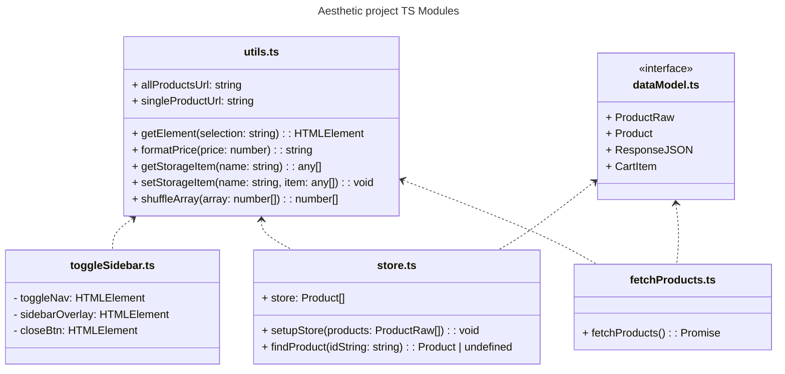

# front-end-project

## Introduction

This is a a dynamic solo project to demonstrate the ability to use plain HTML, CSS, and TypeScript to build the most viable features of an electronic commerce website where the users can:

- Browse the list of products
- Inspect a single products
- Full CRUD on the shopping cart

The project is deployed live at : [Aesthetik Shop](https://jimmytran1206.github.io/front-end-project/index.html)

## Technology used

**HTML5**:

- Semantic tags
- Mixed used of dialog and traditional modals
- Page loading

**CSS**:

- Responsive layout
- Flexbox, Grid, transformation
- CSS Variables

**TypeScript**:

- Asynchronous data fetching from [Dummy JSON](https://dummyjson.com/) API
- Code organization in modules
- Pagination and dynamic rendering

**Third-party library**

- Third-party library [jQuery](https://jquery.com/) and [jQuery Magnify
  ](https://thdoan.github.io/magnify/) are used to make a magnifier lens when viewing individual products.

## Module structure

TypeScript codes are organized into modules for dynamic rendering and future expansion. A glance look at those modules are explained below

### Module `utils.ts`

- Includes the API links, utility functions to get HTML elements, format price, get/set local storage items, and shuffle array elements.

### Module `dataModel.ts`

- Includes data type interfaces expected from the API

### Module `toggleSidebar.ts`

- Turns the navbar on/off in the mobile view when the navbar collapses into a hamburger icon.

### Module `store.ts`

- Include `store` variable which act as a container for all items getting back from the API, as well as other functions to process data getting back from API

### Module `magnify.ts`

- Contains third-party library that is used for magnifier lens. This module is not shown in the UML diagram for simplicity.

### Module `fetchProducts.ts`

- Contains function to fetch the product from the API and return the response `Promise`

